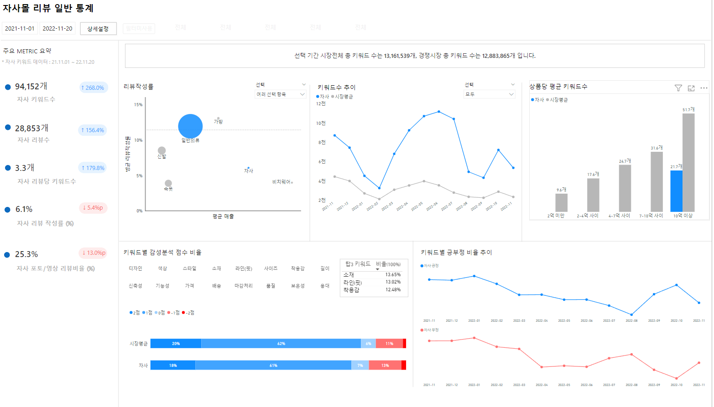

# 프로젝트 목적
패션 온라인 몰의 상품 카테고리별 주문수에 영향을 끼치는 요소와 경쟁사의 판매 동향을 파악하기 위한 대시보드를 제작

# 대시보드 제작 과정
1. 정의
	목적 정의
	지표 정의
	데이터 정의
2. 데이터 
	데이터 수집
	데이터 전처리
3. 대시보드 기획
4. 데이터셋 생성
	테이블 관계 설정
5. 대시보드 생성
	측정값 정리
	대시보드 계산그룹 코드 정리
	개체 정리
	상호 상용 정리
6. 마무리
	데이터 셋 파이프라인 생성
	여러 고객사 대시보드 관리

# 대시보드 구성

## 기본 통계

  

## 필터 설정 : 경쟁 그룹 세팅

  
경쟁 그룹의 함수의 가상테이블로 연산

### 리뷰 작성률

  
리뷰 작성률과 매출, 카테고리로 자사몰과 경쟁 그룹 간의 유사성 확인
원 마크의 크기는 해당되는 고객사 수
마크 색상으로 경쟁 그룹과 자사 카테고리 구분

~~~
모든 측정값은 기본 측정값을 생성 후 각 차트에 넣는 차트 측정값을 별도 생성하여 적용
기본 측정값은 해당 차트에 맞도록 전용 필터값을 계산 그룹으로 생성
필터 값 변경 시에는 계산 그룹만 변경하는 식으로 작업 생산성을 높임
~~~

차트 작성률 식
~~~python
P1C1_리뷰 =

SWITCH(TRUE(),

SELECTEDVALUE('DT_CATEGORY_LEGEND'[카테고리])="일반의류",

[일반의류작성률],

SELECTEDVALUE('DT_CATEGORY_LEGEND'[카테고리])="신발",

[신발작성률],

	   ..............

SELECTEDVALUE('DT_CATEGORY_LEGEND'[카테고리])="자사",

[자사작성률],

SELECTEDVALUE('DT_CATEGORY_LEGEND'[카테고리])="경쟁그룹",

    IF(

    SELECTEDVALUE(DT_E_CATEGORY_AGE_FILTER[연령대])="전체" &&

    SELECTEDVALUE(DT_E_CATEGORY_GENDER_FILTER[성별])="전체" &&

    SELECTEDVALUE(DT_E_CATEGORY_SALES_FILTER[segment])="전체" &&

    SELECTEDVALUE(DT_E_CATEGORY_STYLE_FILTER[스타일])="전체" &&

    SELECTEDVALUE(DT_E_CATEGORY_CATEGORY_FILTER[카테고리])="전체"

    ,"",[경쟁사작성률]

    )

)
~~~

작성률 식
~~~python
일반의류작성률 =

divide(

calculate([FT_E_MALL_REVIEWS_COMP리뷰수],'CG_REVIEWDATE_FILTERS'[Name]="FT_E_MALL_REVIEWS_COMP_dDATE",'CG_review_rate_mall_filter'[Name]="일반의류리뷰"),

calculate([FT_E_PRODUCT_PURCHASE판매수],'CG_REVIEWDATE_FILTERS'[Name]="FT_E_PRODUCT_PURCHASE_DATE",'CG_review_rate_mall_filter'[Name]="일반의류판매")

)
~~~

계산 그룹 식('CG_review_rate_mall_filter'[일반의류판매])
~~~python
var scope_1 = 
summarize(
calculatetable(DT_E_CATEGORY_CATEGORY,
keepfilters('DT_E_CATEGORY_CATEGORY'[category]="일반의류"),
removefilters('DT_E_CATEGORY_CATEGORY_FILTER'[카테고리])
),[mallid])

return

calculate(selectedmeasure(),KEEPFILTERS('FT_E_MALL_REVIEWS_COMP'[mallid] in scope_1 && 'FT_E_MALL_REVIEWS_COMP'[mallid] <> selectedvalue('DT_E_MALLID'[mallid])),
REMOVEFILTERS ( 'DT_E_MALLID'[mallid] ) )
~~~

### 키워드수 추이

  
파워쿼리로 선택 시간에 따라  x축 동적 스케일링 구현

차트 측정값
~~~python
P1C2_키워드_max =

SWITCH(true(),

DATEDIFF(min('DT_E_BASEDATE_REVIEWS'[date]),max('DT_E_BASEDATE_REVIEWS'[date]),day) <=30,

[DATE],

DATEDIFF(min('DT_E_BASEDATE_REVIEWS'[date]),max('DT_E_BASEDATE_REVIEWS'[date]),day) >30 &&

DATEDIFF(min('DT_E_BASEDATE_REVIEWS'[date]),max('DT_E_BASEDATE_REVIEWS'[date]),day) <=180 ,

[YR_MONTH_WEEK],

DATEDIFF(min('DT_E_BASEDATE_REVIEWS'[date]),max('DT_E_BASEDATE_REVIEWS'[date]),day) >180,

[YR_MONTH]

)
~~~

키워드 수 측정값(선택 기간이 30일 이하인 경우)
~~~python

  CALCULATE([CG_키워드카운트_자사_날짜필터],CG_DT_BASEDATE_REVIEWS_UNPIVOT[Name]="date")

~~~

30일 이하 기간 x축 선택하는 측정값(CG_DT_BASEDATE_REVIEWS_UNPIVOT[["date"])
~~~python
CALCULATE (
    SELECTEDMEASURE (),
    KEEPFILTERS ( 'DT_E_BASEDATE_REVIEWS_UNPIVOT'[특성] = "date" ),
    userelationship('FT_E_MALL_KEYWORDDIST'[created_at],'DT_E_BASEDATE_REVIEWS_UNPIVOT'[date_copy])
)
~~~

  

DT_E_BASEDATE_REVIEWS_UNPIVOT 파워 쿼리 M code
~~~C++
let
    원본 = DT_E_BASEDATE_REVIEWS,
    #"변경된 유형1" = Table.TransformColumnTypes(원본,{{"월간 주", type text}}),
    #"추가된 사용자 지정 항목" = Table.AddColumn(#"변경된 유형1", "yr_month_week", each [yr_month]&"-"&[월간 주]),
    #"중복된 열" = Table.DuplicateColumn(#"추가된 사용자 지정 항목", "date", "date - 복사"),
    #"이름을 바꾼 열 수" = Table.RenameColumns(#"중복된 열",{{"date - 복사", "date_copy"}}),
    #"제거된 열 수" = Table.RemoveColumns(#"이름을 바꾼 열 수",{"quarter", "month", "day", "order", "월간 주", "연간 주", "season"}),
    #"피벗 해제된 열 수" = Table.UnpivotOtherColumns(#"제거된 열 수", {"date_copy"}, "특성", "값")
in
    #"피벗 해제된 열 수"
~~~

### 상품당 평균 키워드수

  
자사가 속한 매출 그룹과 경쟁 그룹 및 시장 평균과 비교하여 상품 등록수에 비해 리뷰가 많이 작성되었는지 여부를 확인 

### 키워드별 감성분석 점수 비율

  
리뷰를 대표할 수 있는 키워드로 분류하고 각 키워드의 감성분석을 통해 어느 키워드의 부정의견이 높은지 확인

### 키워드별 긍부정 비율 추이

  
자사와 경쟁 그룹의 키워드별 감성분석 후 긍정 부정 비율의 시계열 변화 확인

## 키워드 분석

  
자사와 경쟁 그룹에서 좀 더 세분화된 그룹으로 비교하기 위한 페이지

### 비교 그룹 설정

  

### 그룹별 통계

  
패션 쇼핑몰 카테고리별 계절별 각 키워드의 긍정 부정 비율과 키워드수의 비율 확인

# 데이터 셋 구성

  

~~~
각 차트에 축 역할을 하는 레전드 테이블은 별도 생성
~~~

